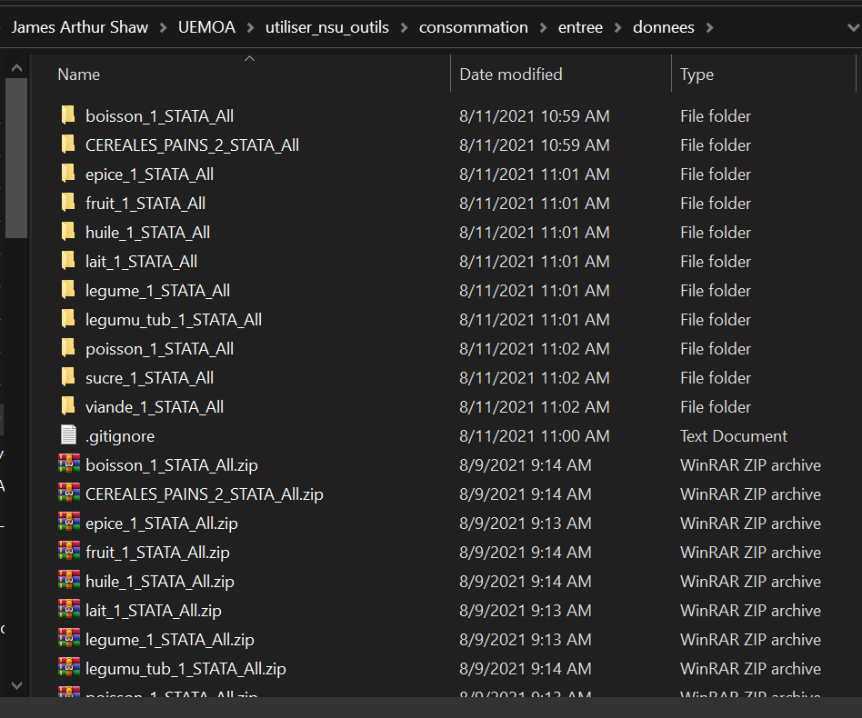

<!-- README.md is generated from README.Rmd. Please edit that file -->

# utiliser\_nsu\_outils

<!-- badges: start -->
<!-- badges: end -->

## Installation

Avant de lancer ce programme pour la première fois, (re)installer les
logiciels suivants:

-   R
-   RTools
-   RStudio

Même si ces logiciels ont été déjà installés (e.g., lors d’une vague
antérieure d’EHCVM), il faut réinstaller afin d’avoir une version
récente d ces outils pour que le programme marche avec succès.

Veuillez lire ici-bas comment obtenir et installer ces logiciels

### R

-   Suivre ce [lien](https://cran.r-project.org/)
-   Cliquer sur le lien approprié pour votre système d’exploitation
-   Cliquer sur `base`
-   Télécharger et installer (e.g.,
    [ceci](https://cran.r-project.org/bin/windows/base/R-4.1.1-win.exe)
    pour Windows)

### RTools

Nécessaire pour le système d’exploitation Windows

-   Suivre ce [lien](https://cran.r-project.org/)
-   Cliquer sur `Windows`
-   Cliquer sur `RTools`
-   Télécharger et installer (e.g.,
    [ceci](https://cran.r-project.org/bin/windows/Rtools/rtools40v2-x86_64.exe)
    pour un système 64)

Ce programme permet à R de compiler des scripts C++ utilisés par
certains packages (e.g., `{dplyr}`).

### RStudio

-   Suivre ce [lien](https://www.rstudio.com/products/rstudio/)
-   Sélectionner RStudio Desktop puis Open Source Edition
-   Cliquer sur le lien approprié pour votre système d’exploitation
-   Télécharger et installer (e.g.,
    [ceci](https://www.rstudio.com/products/rstudio/download/#download)
    pour Windows)

### Ce programme

-   Obtenir une copie du répositoire
    -   Naviguer vers [ce
        répositoire](https://github.com/arthur-shaw/utiliser_nsu_outils)
    -   Cliquer sur le bouton `Code`
    -   Cliquer sur `Download ZIP`
    -   Télécharger vers le répertoire voulu sur votre machine
        
-   Décomprimer le fichier zip

## Emploi

### Mise en place de fichiers d’entrée

Ce programme organise les fichiers comme suit:

    #> .
    #> +-- consommation
    #> |   +-- entree
    #> |   |   +-- donnees
    #> |   |   \-- images
    #> |   \-- sortie
    #> |       +-- donnees
    #> |       \-- images
    #> +-- docs
    #> +-- production
    #> |   +-- entree
    #> |   \-- sortie
    #> \-- renv
    #>     +-- library
    #>     |   \-- R-4.0
    #>     +-- local
    #>     \-- staging

Pour que le programme produit des sorties, il faut lui fournir des
inputs: des données et des images.

Pour les NSU de consommation, mettre:

-   Données dans `consommation/entree/donnees`
-   Images dans `consommation/entree/images`

Pour les NSU de production, mettre les données dans
`production/entree/`.

Dans les deux cas, décomprimer chaque fichier zip pour que le contenu
occupe un dossier à lui. Par exemple:



### Adaptations du programme

Adapter le programme au contexte. Ceci implique deux étapes:

1.  Modifier Modifier le lien vers votre programme
2.  Spécifier les composants d’une strate
3.  Modifier `dir_regexp` pour les fichiers de production

#### Modifier le lien vers votre programme

La variable `projet_dir`, en tête de programme, le répertoire où trouver
ce programme sur votre machine. Modifier ce chemin pour refleter votre
situation.

``` r
# =============================================================================
# Fournir les répertoires
# =============================================================================

projet_dir <- "C:/EHCVM/NSU/"                     # où se trouve le projet
```

En ce faisant, faire attention à deux points importants:

1.  Employer des slashs au lieu d’anti-slashs. Par exemple: ceci
    `"C:/EHCVM/NSU/"` plutôt que celà `"C:\EHCVM\NSU\"`.
2.  Mettre un slash à la fin du chemin. Par exemple: ceci
    `"C:/EHCVM/NSU/"` plutôt que celà `"C:/EHCVM/NSU"`.

Pour modifier le programme:

-   Ouvrir RStudio
-   Ouvrir le fichier `fusionner_et_classer_nsu.R`
-   Modifier la valeur de la variable `projet_dir`
-   Sauvegarder le programme

#### Spécifier les composants d’une strate

Des répertoires seront créés par produit-unité-strate. Pour définir les
strates d’intérêt de l’enquête, fournir une vecteur de nom de variables
qui, ensemblent, forment les strates de l’échantillon NSU.

En de termes concrets, modifier la valeur de la variable
`variables_strate`. L’exemple ici-bas montre le cas, assez fréquent, de
strates composés par la région (`s00q01`) et le milieu (`s00q04`).

``` r
# =============================================================================
# Définir les strates
# =============================================================================

# Mettre les variables qui, ensemble, définissent les strates
# Les valeurs serviront à créer des sous-répertoires strates au sein de chaque
# répertoire de produit-unité observé
# - en cas de plusieurs variables, formuler comme suit: c("var1", "var2")
# - en cas d'une seule variable formuler comme un texte: "var1"
variables_strate <- c("s00q01", "s00q04")
```

#### Modifier `dir_regexp` pour les fichiers de production

Les fonctions `combine_nsu_data` et `combine_market_data` ont besoin
d’un paramètre `dir_regexp` afin d’indentifier les répertoires qui
contiennent les données de production. Il s’agit d’un texte qui se
trouve dans le nom de tous les répertoires d’intérêt. Par défaut, la
valeur est `"_production_"`. Si votre situation est différente, mettre
un texte qui se trouve à l’intérieur du nom des répertoires avec des
données de production.

``` r
# =============================================================================
# NSU de production
# =============================================================================

nsuoutils::combine_nsu_data(
    dir_in = nsu_prod_entree,
    dir_regexp = "_production_", # NOTEZ BIEN: modifier selon votre situation
    data_type = "production",
    dir_out = nsu_prod_sortie
)

# Fusionner les observations au niveau des marchés
nsuoutils::combine_market_data(
    dir_in = nsu_prod_entree,
    dir_regexp = "_production_", # NOTEZ BIEN: modifier selon votre situation
    data_type = "production",
    dir_out = nsu_prod_sortie
)
```

### Utilisation

### Lancer

Une fois les préparatifs ci-haut terminés, il est temps de lancer le
programme. Pour ce faire:

-   Ouvrir RStudio
-   Ouvrir le fichier `utiliser_nsu_outils.Rproj` qui aura l’effet de
    fournir les ressources du projet
-   Ouvrir le fichier `fusionner_et_classer_nsu.R` que vous avez modifié
    plus haut
-   Lancer le programme
-   Accepter de mettre à jour les packages

Après avoir ouvert le fichier `utiliser_nsu_outils.Rproj`, RStudio
affichera un message comme suit, indiquant que:


-   Le package `{renv}`, qui est reponsable contrôles la version des
    packages chez tous les utilisateurs, a été installé
-   La version de R installée sur votre machine soit est soit n’est pas
    en en phase avec la version indiqué dans le fichier de contrôle de
    version.

Si votre version de R n’est pas en accord avec la version de R attendu,
veuillez installer la version convenue. S’il s’agit d’une plus ancienne
version de R, il faut aller la chercher sur CRAN:

-   Suivre les instructions [ici](#r)
-   Suivre le lien montré ici-bas 
-   Chercher, obtenir, et installer la version convenue (e.g., 4.0.4)
    

Lors du premier lancement du, RStudio demandera si vous voulez adopter
les packages demandé pour ce projet, comme indiqué ici-bas.


Taper `y` dans la console de RStudio. Ceci créera un répertoire pour ce
projet dont les versions des packages s’accorderont avec ce qui est jugé
nécessaire pour le bon déroulement du programme. Ceci n’aura pas d’effet
sur les versions des packages installées sur votre machine. Pour en
savoir plus, regarder la documentation de `{renv}`
[ici](https://rstudio.github.io/renv/articles/renv.html).

### Afficher les images non-classées

La fonction `nsuoutils::sort_images()` tente de classer toutes les
images retrouvés dans les images exportées. Mais elle ne pourra classer
que les images où le nom de l’image paraît dans la base de données.
Donc, certaines images ne seront pas classées.

Pour voir la liste d’images non-classées, executer la command
`warnings()` après avoir exécuté la commande `nsuoutils::sort_images()`.

### Relancer des entrées plus récentes

Le programme pourra être relancé autant de fois que voulu sans poser de
problème. Ceci permet aux utilisateurs de relancer le programme au fur
et à mesure que de nouvelles informations sont reçues du terrain. Les
données seront refusionnées, et les images seront re-classées en
fonction des informations dans les bases de données et d’images,
respectivement.

### Dépanner

#### Problèmes connus

Si vous lancez le programme comme indiqué ci-haut et rencontrez une
erreur qui ressemble celle ici-bas, R rencontre un problème à
télécharger et installer les packages requis.


Pour surmonter ce problème, veuillez suivre ces étapes:

-   Ouvrir le fichier Rproj
-   Avant de lancer le programme, exécuter la commande:
    `Sys.setenv(RENV_DOWNLOAD_METHOD = "wininet")`
-   Lancer le programmer

Si le lancement du programme échoue à nouveau, il est fort à parier que
R–ou plutôt le package `{renv}`–rencontre problèmes à télécharger et
installer le package `{nsuoutils}` depuis GitHub.

Pour aider R à installer `{nsuoutils}`, veuillez suivre ces étapes:

-   Ouvrir une nouvelle instance de RStudio. C’est à dire:
    -   Fermer toute fenêtre de RStudio déjà ouvert
    -   Ouvrir RStudio à nouveau
    -   S’assurer que le projet `utiliser_nsu_outils` est bien fermé. Au
        besoin, le fermer comme montré ici-bas:


-   Installer les packages manquants en exécutant les commandes
    suivantes:

``` r
# d'abord installer {nsuoutils}
install.packages("devtools")
devtools::install_github("arthur-shaw/nsuoutils")
 
# ensuite, installer {rmarkdown} 
# au cas où il n'est pas installé lors de l'installation de {nsuoutils}
install.packages("rmarkdown")
```

-   Relancer le programme le programme comme indiqué [ici](#lancer)

#### Problèmes inconnus

Si vous disposer d’un compte GitHub, créer un issue
[ici](https://github.com/arthur-shaw/nsuoutils), chez le package
responsable des manipulations faites dans ce programme.

Si vous n’avez pas de compte, envoyer un message.

Dans les deux cas, tâcher de fournir un descriptif détaillé et, si
possible, un exemple reproduisible. Dans le descriptif détaillé,
envoyer:

-   Description des étapes suivies
-   Capture d’écran du message d’erreur
-   Informations concernant votre séance de travail, lancer des
    commandes après l’échec du programme et copier-coller le résultat:

``` r
# ceci fournit des informations détaillées sur les actions prises par {renv}
# dans l'installation de packages requis, et met en évidence
# les problèmes rencontrés et les paramètres utilisé 
renv::diagnostics()

# ces commandes fournissent des informations sur:
# - la méthode employée pour télécharger les packages
# - le répositore où les packages sont recherchés
getOption("download.file.method")
capabilities("libcurl")
getOption("repos")

# cette commande fournit des informations sur votre environnement d'exécution
sessionInfo()
```

Dans l’exemple reproduisible, partager les données d’entrée par un moyen
sécurisé (i.e., pas GitHub, rien de publique où d’autres peuvent voir
les données).
